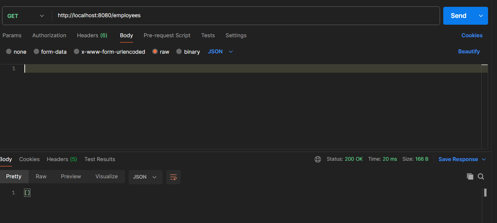
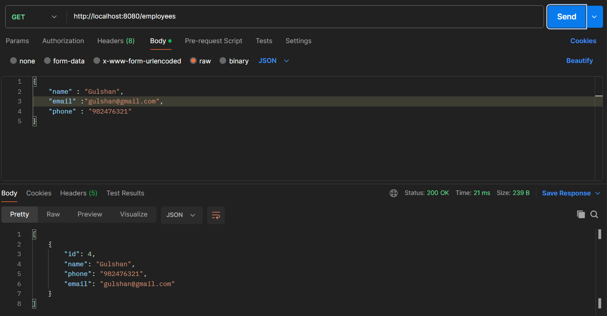
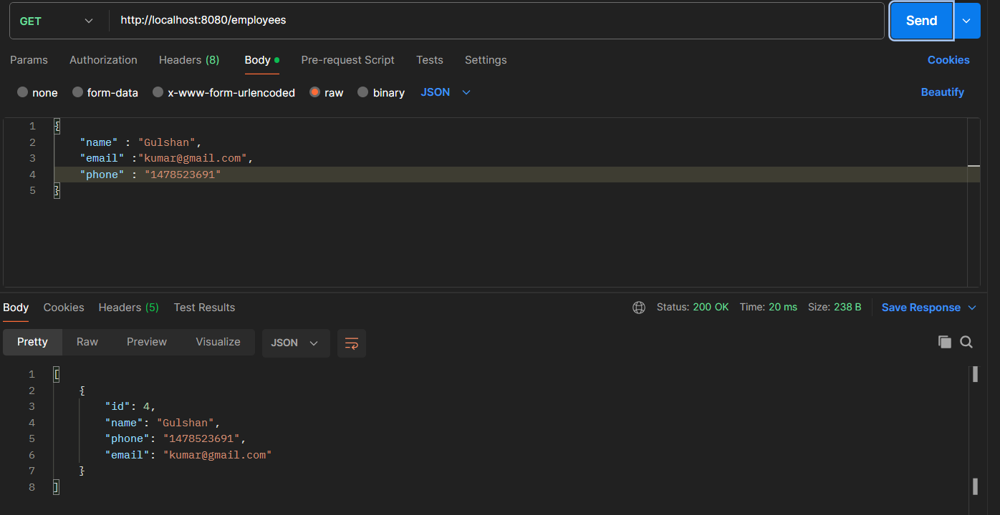
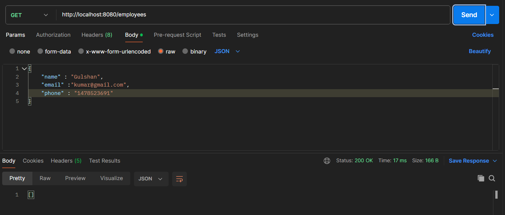

# Spring-Boot
"A collection of basic Spring Boot examples and a small demo project covering essential features like REST APIs, data access, and dependency injection."

Before Inserting Data
=====================

After Adding Employee Detail To the Database
============================================

After Updating Employee's Email and Phone
=========================================

After Deleting the database
===========================

